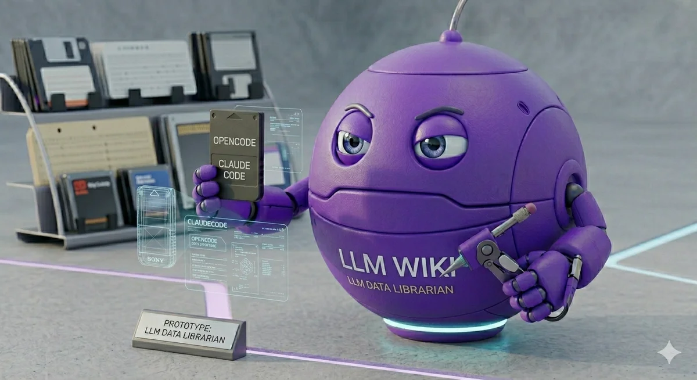
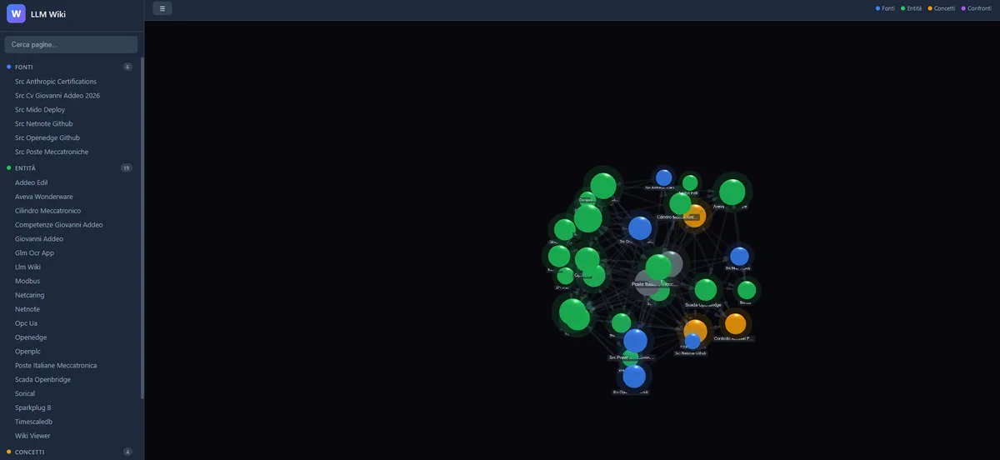
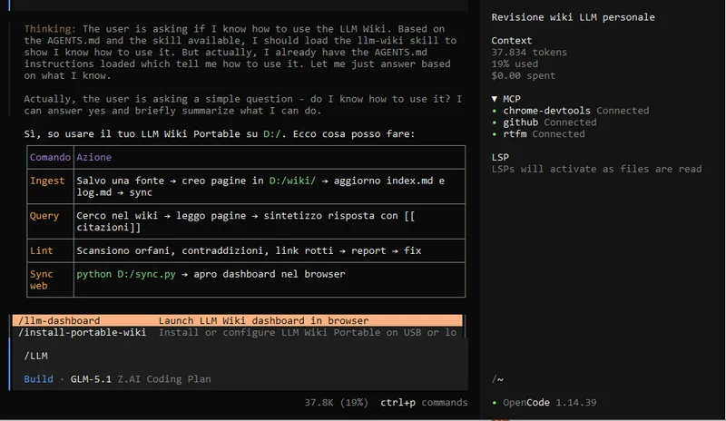

# LLM Wiki Portable

<p align="center">
  
</p>

<p align="center">
  <a href="https://github.com/inferis995/llm-wiki-portable/stargazers"></a>
  <a href="https://github.com/inferis995/llm-wiki-portable/blob/master/LICENSE"></a>
  
  
  
  
  
</p>

Your personal AI-powered knowledge base — on a USB stick or any folder.

Works with **Claude Code** and **OpenCode**. Write markdown pages with `[[wikilinks]]`, visualize them as a 3D graph, and carry everything on a USB drive. Ask Claude to ingest sources, query your knowledge base with semantic search, and generate new pages automatically.

## Features

- **3D Knowledge Graph** — Interactive force-directed graph, color-coded by category
- **Semantic Search** — RTFM MCP with embeddings (hybrid FTS + vector search)
- **AI-Powered** — Claude Code or OpenCode read, write, and query the wiki for you
- **USB Portable** — Plug into any PC, run one command, done
- **Markdown + Wikilinks** — `[[page-links]]` like Obsidian, backlinks auto-generated
- **Offline** — Static HTML/JS, works with `file://`, no server needed
- **Python 3.8+** — No external dependencies for the core; `rtfm-ai` installed automatically

## Dashboard

<p align="center">
  
</p>

Interactive 3D graph with color-coded categories: **Fonti** (blue), **Entità** (green), **Concetti** (amber), **Confronti** (purple). Click any node to read the page. Sidebar with live search (searches titles, tags, and content). Keyboard: `/` to search, `Esc` to go back.

## Quick Start

### Step 1 — Clone the repo

```bash
git clone https://github.com/inferis995/llm-wiki-portable
cd llm-wiki-portable
```

### Step 2 — Install commands

```bash
# Linux / macOS
bash install-commands.sh

# Windows (PowerShell)
powershell -File install-commands.ps1
```

This copies the slash commands to Claude Code and OpenCode, and installs `rtfm-ai[embeddings]` for semantic search.

### Step 3 — Set up your wiki

Open **Claude Code** or **OpenCode** and run:

```
/install-portable-wiki
```

Claude will ask:
1. **Where** to put the wiki (USB drive path or any folder)
2. **Which mode:**
   - **Classica** — Wiki + 3D graph UI only. No MCP, no semantic search.
   - **Completa** — Everything above + RTFM MCP semantic search + global `~/.claude/CLAUDE.md` so Claude finds your wiki from any directory.

<details>
<summary>OpenCode with commands</summary>

<p align="center">
  
</p>

</details>

### Step 4 — Use it

```
/llm-dashboard    ← Open the 3D graph in your browser
```

Then talk to Claude:
- *"Ingest this PDF"* → Claude creates wiki pages with wikilinks
- *"What do I know about Docker networking?"* → Claude searches and answers with citations
- *"Show me everything related to [[kubernetes]]"* → Claude reads the graph

> **After setup (Completa mode):** Claude finds your wiki from **any directory** — you don't need to open a terminal in the wiki folder. The global `~/.claude/CLAUDE.md` points to your USB/folder path.

## How It Works

```
~/.claude/CLAUDE.md          ← Global AI instructions (points to your USB path)
~/.config/opencode/agents/wiki.md  ← OpenCode global agent

USB Drive (or any folder)/
├── wiki/                    ← Your pages (markdown with wikilinks)
│   ├── sources/src-*.md     ← Source summaries
│   ├── entities/            ← Tools, companies, people
│   ├── concepts/            ← Ideas, protocols, patterns
│   └── comparisons/         ← A vs B
├── raw/                     ← Original files (PDFs, images) — never modified
├── web/                     ← Static web UI (open index.html in browser)
│   └── data.js              ← Auto-generated by sync.py
├── .rtfm/library.db         ← Semantic search database (Completa mode)
└── sync.py                  ← Regenerates graph data from markdown
```

### The Workflow

1. **You give Claude a source** (PDF, URL, paste text)
2. **Claude creates wiki pages** with `[[wikilinks]]` and cross-references
3. **Claude runs `sync.py`** to rebuild the graph
4. **Claude re-indexes** with RTFM (`rtfm_sync`) for semantic search
5. **You open `/llm-dashboard`** to see the 3D graph
6. **You ask questions** — Claude searches with embeddings and answers with `[[citations]]`

### Moving to Another PC

Plug the USB into a new computer → open Claude Code or OpenCode → run `/install-portable-wiki`. The command detects the existing wiki and only configures the local system (MCP, global CLAUDE.md, commands). Your data stays on the USB.

## Page Format

```markdown
---
created: 2026-05-08
updated: 2026-05-08
sources: [[src-my-source]]
tags: [tag1, tag2]
---

# Page Title

Content with [[wikilinks]] to other pages.

## Key Points
- Point 1

## Related
- [[other-page]]
```

## Requirements

| Requirement | Notes |
|-------------|-------|
| **Claude Code** or **OpenCode** | AI assistant that runs the commands |
| **Python 3.8+** | For `sync.py` and RTFM MCP |
| **pip** | `rtfm-ai[embeddings]` installed automatically by `install-commands.sh` |
| **USB drive or folder** | Any writable path works |
| **Browser** | For the 3D graph UI |

> Python and pip must be in your system PATH before running `install-commands.sh`.

## Commands

| Command | Description |
|---------|-------------|
| `/install-portable-wiki` | Install wiki on USB or configure on a new PC |
| `/llm-dashboard` | Open the 3D graph in browser (auto-syncs if pages changed) |

## Modes

| Mode | What you get |
|------|-------------|
| **Classica** | Wiki + 3D graph UI + slash commands. No MCP. |
| **Completa** | Everything in Classica + RTFM MCP semantic search + global `~/.claude/CLAUDE.md` + OpenCode `@wiki` agent |

## Tech Stack

- **Web UI**: Vanilla HTML/CSS/JS (no framework, no build step)
- **Graph**: [3d-force-graph](https://github.com/vasturiano/3d-force-graph) + Three.js + D3.js
- **Markdown**: [marked.js](https://marked.js.org/)
- **Semantic Search**: [RTFM MCP](https://github.com/roomi-fields/rtfm) with fastembed ONNX
- **Sync**: `sync.py` — zero dependencies, Python 3.8+

## License

MIT
