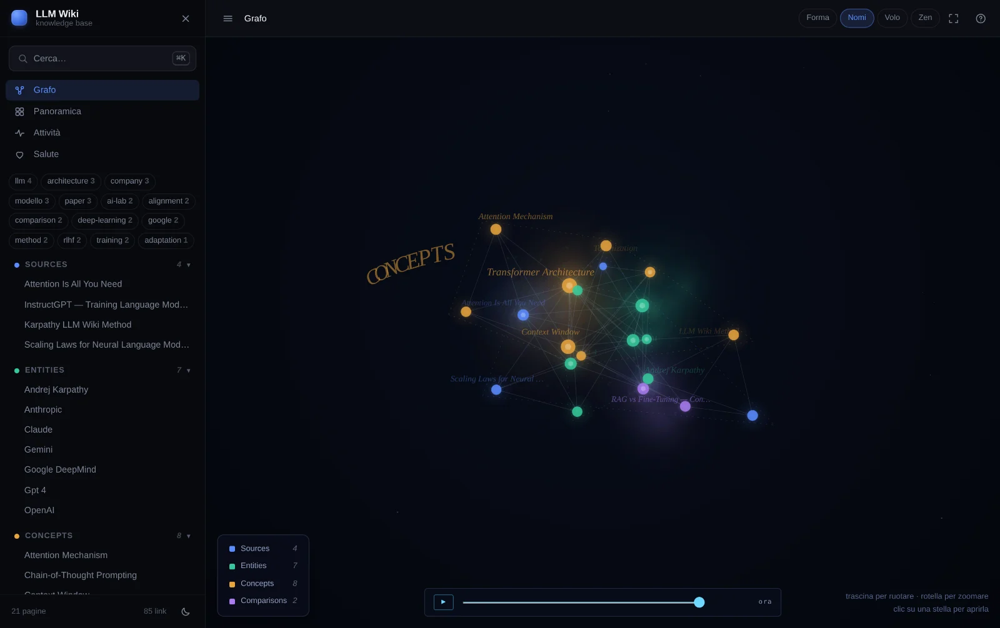
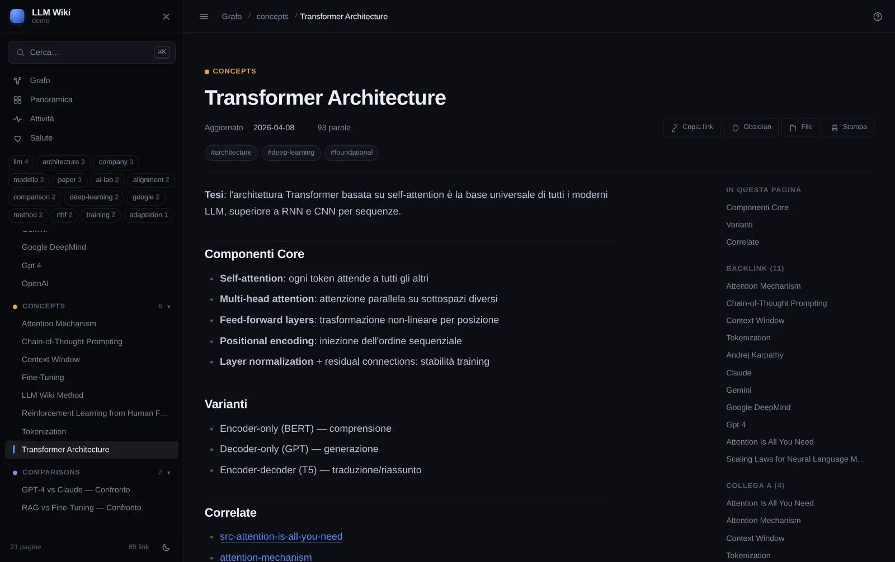
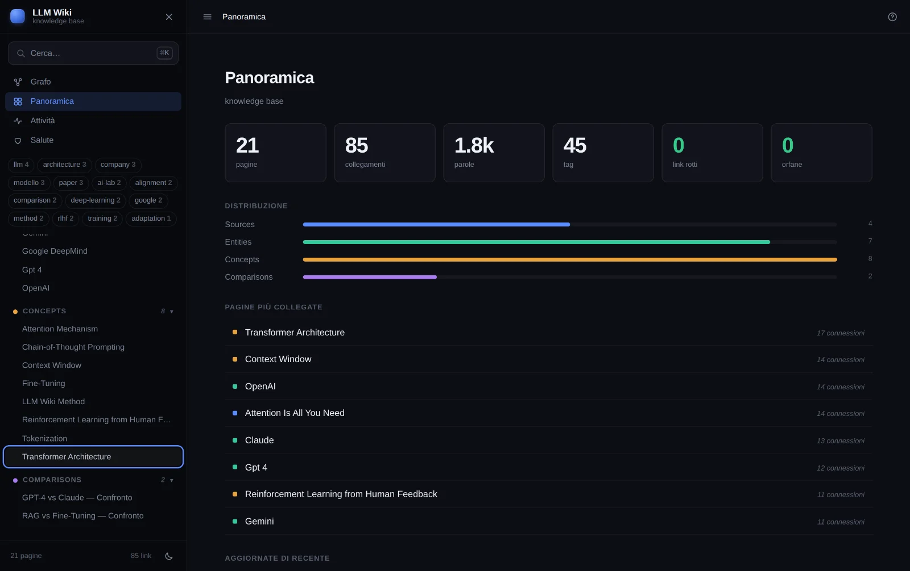
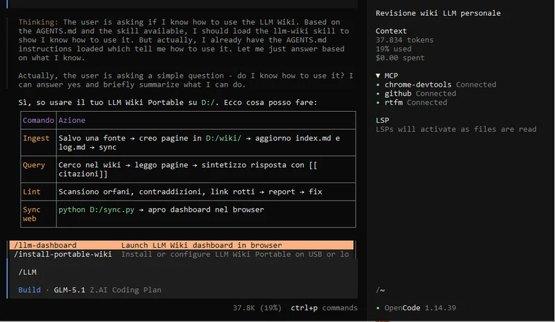

# LLM Wiki Portable

<p align="center">
  
</p>

<p align="center">
  <a href="https://llm-wiki-lyart.vercel.app/"></a>
  <a href="https://inferis995.github.io/llm-wiki-portable/"></a>
  <a href="https://github.com/inferis995/llm-wiki-portable/stargazers"></a>
  <a href="https://github.com/inferis995/llm-wiki-portable/blob/master/LICENSE"></a>
  
  
  
  
</p>

<p align="center">
  <a href="https://llm-wiki-lyart.vercel.app/">🌐 llm-wiki-lyart.vercel.app</a>
  &nbsp;·&nbsp;
  <a href="https://inferis995.github.io/llm-wiki-portable/">📊 Demo Graph (GitHub Pages)</a>
</p>

Una knowledge base personale che il tuo agente AI **usa davvero** — su chiavetta
USB, cartella locale o cloud.

Basata sul [metodo LLM Wiki di Karpathy](https://gist.github.com/karpathy/442a6bf555914893e9891c11519de94f):
l'LLM non ricerca le fonti a ogni domanda (come il RAG), le **compila** una volta
in pagine markdown collegate da `[[wikilink]]`, e da lì in poi risponde da quelle.

## Perché la v2

La v1 metteva le istruzioni in un file di contesto e sperava che il modello le
seguisse. Nella pratica se ne dimenticava: non consultava la wiki, non salvava,
non lanciava il sync.

La v2 rende tutto questo **automatico**:

| | Succede da solo |
|---|---|
| **Ogni sessione** | l'agente riceve indice della wiki e ultime operazioni |
| **"cosa so su X?"** | la wiki viene cercata e iniettata **prima** che risponda |
| **Ogni scrittura in `wiki/`** | il grafo si risincronizza |
| **Fine sessione** | auto-commit git; se avevi chiesto di salvare e non è stato scritto nulla, te lo dice |

Su Claude Code sono quattro hook, su OpenCode un plugin. Non è più una scelta
del modello.

## Features

- **L'agente non dimentica** — hook e plugin, non solo istruzioni in prosa
- **Mappa stellare** — le pagine sono stelle, le cartelle costellazioni, i wikilink fili di luce
- **Quattro viste** — grafo, pagina con backlink, panoramica, timeline delle attività
- **Command palette** — `⌘K` per cercare pagine, tag e azioni
- **Portatile davvero** — la wiki si ritrova anche se la chiavetta cambia lettera
- **Chiavetta autosufficiente** — install, skill e tool viaggiano sull'USB
- **Ricerca BM25 + lint** — CLI a dipendenze zero, non solo `grep`
- **Ingest PDF / DOCX / URL / immagini**
- **Versionata con git** — la distillazione riscrive, git ti fa tornare indietro
- **Offline** — HTML/JS statico, funziona con `file://`
- **Python 3.8+**, nessuna dipendenza esterna

## Installazione

```bash
git clone https://github.com/inferis995/llm-wiki-portable
cd llm-wiki-portable
bash install-commands.sh          # Windows: powershell -File install-commands.ps1
```

Poi apri **Claude Code** o **OpenCode** e scrivi:

```
/install-portable-wiki
```

oppure semplicemente *"installa la wiki"*: la skill `llm-wiki-setup` si attiva
da sola. Ti chiede tre cose — **dove** (cartella locale, USB o cartella cloud),
**quale template**, **quale lingua** — e fa il resto.

> Gli hook si caricano all'avvio: **riavvia Claude Code o OpenCode** dopo
> l'installazione.

Se preferisci saltare la skill:

```bash
python3 install.py --mode local --target ~/wiki --template general --lang it
python3 install.py --mode usb   --target /media/usb/wiki --template work
```

### Hai già una wiki (v1 o v2)?

```bash
python3 install.py --mode upgrade
```

Rileva l'installazione esistente, ne deduce il template, **non tocca `wiki/` né
`raw/`** e migra la configurazione. Arrivando dalla v1 corregge anche il
`~/.claude/CLAUDE.md` sovrascritto (con backup) e rimuove il subagent OpenCode
che non si attivava mai.

### Nuovo PC, wiki già su USB

```bash
python3 /media/usb/wiki/install.py --mode newpc
```

L'`install.py` è **sulla chiavetta**: non serve riclonare il repo.

### Verifica

```bash
python3 install.py --mode doctor
```

## Uso

```
/llm-wiki-save     Salva nella wiki quello che questa sessione ha prodotto
/llm-wiki-ask      Interroga la wiki e rispondi citando le pagine
/llm-wiki-lint     Health check e correzione dei problemi
/llm-dashboard     Apri il grafo 3D nel browser
```

Oppure parla e basta:

- *"Ingerisci questo PDF"* → pagine con wikilink, originale archiviato in `raw/`
- *"Cosa so su Docker networking?"* → risponde dalla wiki, con `[[citazioni]]`
- *"Salva questa decisione"* → distilla nella pagina giusta e la collega

Da **qualsiasi cartella**: il resolver trova la wiki da solo.

## Template

| Template | Per chi | Cartelle |
|---|---|---|
| `general` | Studio, note, ricerca personale — Karpathy originale | sources / entities / concepts / comparisons |
| `work` | Freelance: progetti e clienti | projects / clients / meetings / tasks / resources |
| `business` | Knowledge aziendale, SOP, decisioni | departments / processes / people / decisions / documents / meetings |
| `professional` | Avvocato, commercialista, consulente, medico | clients / matters / deadlines / contacts |
| `research` | Ricercatore, giornalista, dottorando, analista | sources / insights / topics / people / output |
| `custom` | Qualsiasi dominio | le definisci tu durante il setup |

Tutti usano lo stesso metodo: **ingest → query → lint**, con distillazione
progressiva — le pagine rappresentano lo stato dell'arte, non appunti accumulati.
Le convenzioni specifiche del dominio stanno in `templates/<nome>/profile.json`.

## Come funziona

```
~/.claude/CLAUDE.md              blocco delimitato -> punta a AGENT-WIKI.md
~/.claude/settings.json          4 hook (merge, mai sovrascritto)
~/.claude/skills/                llm-wiki, llm-wiki-setup
~/.config/opencode/AGENTS.md     blocco delimitato
~/.config/opencode/opencode.json instructions -> AGENT-WIKI.md
~/.config/opencode/plugin/       wiki-sync.js
~/.llm-wiki/roots.json           registro: ritrova la wiki se il drive cambia

USB / cartella/
├── .llmwiki-root        marker: versione, template, id
├── AGENT-WIKI.md        istruzioni per l'agente — fonte unica
├── wiki/                le tue pagine markdown
├── raw/                 originali, mai modificati
├── web/                 dashboard 3D (data.js generato)
├── tools/               sync · search · lint · log · ingest
├── hooks/claude/        i quattro hook
└── install.py           per configurare un PC nuovo
```

### Il ciclo

1. Dai una fonte all'agente (PDF, URL, testo, immagine)
2. L'agente **riscrive** le pagine esistenti distillando, e crea quelle mancanti
3. Il sync riparte da solo, il grafo si aggiorna
4. A fine sessione git committa
5. Alla domanda successiva la wiki viene consultata prima della risposta

## Tool a riga di comando

Tutti trovano la wiki da soli, da qualsiasi directory.

```bash
python3 tools/search.py --query "docker networking" --top 5
python3 tools/search.py --list-pages          # slug validi per i [[link]]
python3 tools/search.py --backlinks concepts/docker
python3 tools/lint.py                          # health check
python3 tools/lint.py --json --only broken
python3 tools/log.py --tail 10
python3 tools/ingest.py --file paper.pdf
python3 tools/ingest.py --url https://esempio.it/articolo
python3 tools/sync.py --rebuild-index
```

## Formato pagina

```markdown
---
created: 2026-08-21
updated: 2026-08-21
verified: 2026-08-21
confidence: high
sources: [[src-nome-fonte]]
tags: [docker, networking]
---

# Docker Networking

Una o due righe che dicono subito la cosa più importante.

## Punti Chiave
- Le bridge network isolano i container sullo stesso host
- [[kubernetes-cni]] risolve lo stesso problema a livello di cluster

## Superato
- 2026-03-01: si riteneva che `--link` fosse la via consigliata — deprecato da [[src-docker-docs]]

## Correlate
- [[docker-compose]]
```

`confidence` (`high`/`medium`/`low`) e `verified` tracciano la provenienza. Le
posizioni superate non si cancellano: finiscono sotto `## Superato`, perché fra
sei mesi sapere *perché* qualcosa è cambiato vale quanto il fatto stesso.

## Dashboard

Quattro viste sulla stessa knowledge base, in un'app statica senza build step.

### Mappa stellare

La wiki come galassia: **ogni pagina è una stella** col suo titolo, ogni cartella
una costellazione con la sua nebulosa e il suo nome su un anello orbitale
inclinato, ogni `[[wikilink]]` un filo di luce. Le pagine aggiornate negli ultimi
giorni pulsano come supernove.

Passando sul mouse: la stella si accende, i suoi vicini restano illuminati, il
resto si spegne, e una scheda mostra estratto, link, backlink e lunghezza. Un
clic apre la pagina.

Controlli: **Forma** cambia la silhouette della galassia (spirale, disco, anello,
guscio, elica, toro, isole, cubo) · **Nomi** i titoli delle pagine · **Volo**
attraversa la galassia con W/A/S/D · **Zen** lascia solo il cielo ·
**Inquadra**. Clic sulla legenda per isolare una costellazione.

La **timeline** in basso riavvolge il tempo: trascina e guarda la wiki crescere
pagina per pagina dalla prima nota, oppure premi play.

Canvas 2D, nessuna libreria: l'intera dashboard sta in ~200 KB e gira offline.

### Pagina

<p align="center">
  
</p>

Tipografia da lettura, e nella colonna laterale quello che nella wiki conta:
**indice della pagina**, **backlink** (chi la cita), **collegamenti in uscita** e
**pagine con tag in comune**. In testa: `confidence`, `verified`, e i pulsanti
Copia link / Obsidian / File / Stampa. I wikilink rotti sono segnati in rosso
sia in linea sia in un avviso in cima.

### Panoramica

<p align="center">
  
</p>

Pagine, collegamenti, parole, tag, link rotti, orfane. Distribuzione per
categoria, pagine più collegate, aggiornate di recente, nuvola di tag.

### Attività e Salute

**Attività** è la timeline di `wiki/log.md`: come la wiki è cresciuta, con i
link alle pagine create e distillate a ogni ingest.
**Salute** elenca link rotti, orfane, pagine troppo lunghe e senza tag, ognuna
cliccabile.

### Comandi rapidi e scorciatoie

`⌘K` / `Ctrl+K` apre la **command palette**: cerca pagine, filtra per tag,
esegue azioni. `⇥` porta la stessa query alla ricerca completa, con anteprime ed
evidenziazione.

| | |
|---|---|
| `⌘K` cerca ed esegui | `?` scorciatoie |
| `g` grafo · `o` panoramica · `a` attività · `h` salute | `t` tema chiaro/scuro |
| `0` inquadra · `m` forma · `l` nomi | `w` volo · `z` zen · `s` sidebar · `Esc` indietro |

Tema chiaro e scuro (segue il sistema, si può forzare), responsive fino al
mobile, e stampa pulita della pagina aperta.

<details>
<summary>OpenCode con i comandi</summary>

<p align="center">
  
</p>

</details>

## Requisiti

| | Note |
|---|---|
| **Claude Code**, **OpenCode** o **Hermes Agent** | l'agente che esegue i comandi |
| **Python 3.8+** | sync, ricerca, lint, ingest — nel PATH |
| **git** | consigliato: versiona la wiki e permette di tornare indietro |
| **Browser** | per il grafo 3D |

Opzionale per i PDF: `pip install pypdf` oppure `poppler-utils`.

## Sviluppo

```bash
python3 -m unittest discover -s tests -v         # 42 test
python3 tools/lint.py --root demo --strict       # la wiki demo deve restare pulita
python3 tools/sync.py --root demo --output web/data.json --rebuild-index
```

La CI gira su Linux, macOS e Windows con Python 3.8 e 3.12, e include uno smoke
test di installazione in una HOME temporanea.

## Stack

- **UI**: HTML/CSS/JS vanilla, nessun framework, nessun build step
- **Mappa stellare**: Canvas 2D scritto a mano, nessuna libreria grafica
- **Markdown**: [marked.js](https://marked.js.org/)
- **Tool**: Python 3.8+, zero dipendenze

## Crediti

La mappa stellare deriva da **[Fathom Starmap](https://github.com/dryweather-2544/fathom-starmap)**
di Ariel Bowyer (MIT) — proiezione, fisica, nebulose, anelli delle costellazioni.
Adattata qui a una wiki markdown statica. Dettagli in [THIRD-PARTY.md](THIRD-PARTY.md).

## Disinstallare

```bash
python3 install.py --mode uninstall
```

Rimuove hook, blocchi di configurazione, plugin e skill. **I dati della wiki
restano intatti.**

## Licenza

MIT
